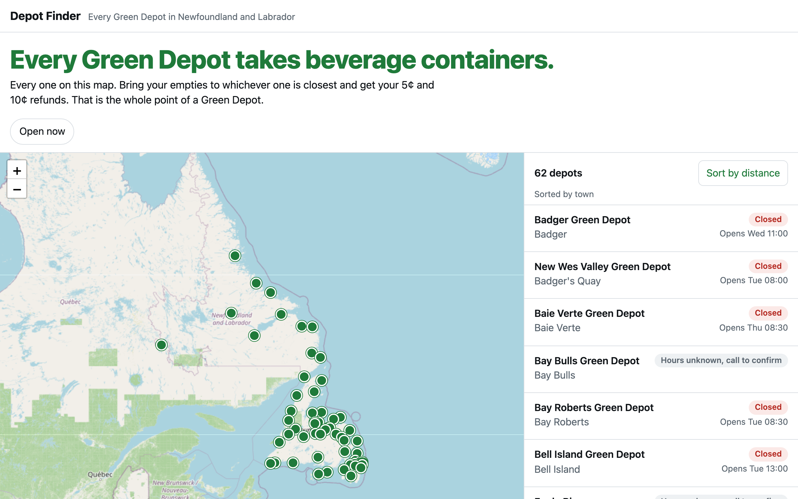

# Depot Finder

Every Green Depot in Newfoundland and Labrador on one map, with hours, phone and open-now. The headline is the point: every one of them takes beverage containers.

The app shows where and when. It deliberately does NOT show the five extras (refillable beer bottles, Iceberg bottles, paper and cardboard, paint, electronics): the research in `data/depots.json` found a cited answer for too few depots to publish (most rows are Unknown), so the app keeps to what is confirmed. The research is kept in the data, cited, for when it fills in.



## What is in the data (2026-09-13, research only, not shown in the app)

| | Yes | No | Unknown |
|---|---|---|---|
| Refillable beer bottles | 1 | 1 | 60 |
| Iceberg bottles | 1 | 1 | 60 |
| Paper and cardboard | 5 | 5 | 52 |
| Paint | 17 | 0 | 45 |
| Electronics | 21 | 3 | 38 |

62 rows: 52 fixed depots, 1 mobile, 9 affiliates. Sources: MMSB's depot locator (64 blocks, two dropped as a closed site and a duplicate), Product Care's paint locator, EPRA's electronics locator, operator sites (Scotia, Ever Green), MMSB's own FAQ and archived ReThinkWasteNL tool, CBC and brewery pages, and the depots' Facebook intros. About 110 web searches, logged per depot in `docs/sources/_raw/SEARCH-LOG.md`, so every Unknown is earned. Facebook posts need a login and were not read.

## Parts

- `app/` static phone-first app: Leaflet map, filters, open-now in the depot's own time zone, depot pages with sources, "Suggest a correction".
- `data/depots.json` the dataset; `data/validate.mjs` (schema, NL bounding box, every Yes/No cited, no blanket claims); `data/summary.mjs`.
- `worker/` Cloudflare Worker + D1 for corrections and stats.
- `app/tests/`, `app/tests/qa/`, `tests/live-roundtrip.mjs` Playwright (Chromium + WebKit, phone + desktop) and node tests. Every suite carries a negative control that was made red once and recorded in `docs/build-report-*.md`.

## Run

```
npm install && npx playwright install chromium webkit
cp worker/.dev.vars.example worker/.dev.vars
npm test            # unit + validator + worker API + Playwright (68 checks)
node data/summary.mjs
```

Deploy: `./deploy.sh` (migrates D1, sets ADMIN_PIN, deploys Worker and static app from `dist/`).

Built with a four-slice Rig crew (research, app, Worker, QA); `PLAN.md` is the contract.
